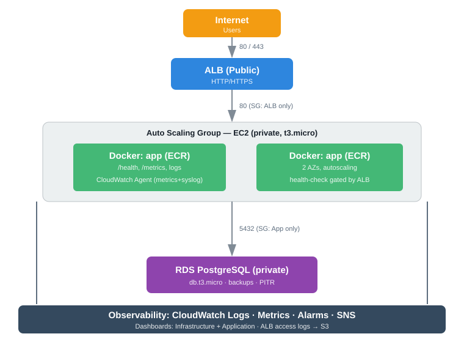

# AWS Infrastructure as Code — Octa Byte AI Assignment

A production-grade, end-to-end cloud infrastructure assignment delivering:

1. **Infrastructure provisioning** with Terraform (VPC, EC2/ASG, RDS PostgreSQL, ALB, Security Groups)
2. **CI/CD automation** with GitHub Actions (tests, container build/scan, staging deploy, manual-approval production deploy)
3. **Monitoring & centralized logging** (CloudWatch metrics, alarms, two dashboards, structured logs)
4. **Documentation & best practices** (architecture, security, cost optimization, secrets management, backup strategy)

> Stack: **AWS + Terraform + Docker + GitHub Actions** · Region: `ap-south-1`

---

## Table of Contents

- [Architecture](#architecture)
- [Directory Structure](#directory-structure)
- [Prerequisites](#prerequisites)
- [Part 1 — Infrastructure (Terraform)](#part-1--infrastructure-terraform)
- [Part 2 — CI/CD (GitHub Actions)](#part-2--cicd-github-actions)
- [Part 3 — Monitoring & Logging](#part-3--monitoring--logging)
- [Part 4 — Best Practices](#part-4--best-practices)
- [Cost Optimization](#cost-optimization)
- [Deliverables](#deliverables)

---

## Architecture



```
                        Internet
                           |
                     [ALB (Public)]
                           |
                 [Security Group: ALB]
                           |
              [Auto Scaling Group]  x2 AZ
                 t3.micro (private)     -- CloudWatch Agent --> CloudWatch Logs / Metrics
                           |
              [Security Group: App]  \
                           \          \--[NAT Gateway]--> Internet (egress)
                        [RDS PostgreSQL] (private, db.t3.micro)
              [Security Group: DB]  (allows 5432 only from App SG)
```

- **Multi-AZ VPC**: public subnets (ALB), private subnets (EC2), database subnets (RDS), spread across 2 availability zones.
- **ALB** terminates traffic and forwards to an auto-scaling group of EC2 instances running the Dockerized app.
- **RDS PostgreSQL** sits in private database subnets, only reachable from the app security group on port 5432.
- **NAT Gateway** provides outbound internet for private instances (e.g. to pull images/python).
- **Monitoring/logging** is centralized in CloudWatch via dashboards, alarms (→ SNS → email), and log groups.

Full decision rationale in [docs/ARCHITECTURE.md](./docs/ARCHITECTURE.md).

---

## Directory Structure

```
.
├── app/                        # Sample Node.js/Express app (Dockerized)
│   ├── src/server.js           # App with /health, /metrics, structured logging
│   ├── test/server.test.js     # Unit/integration tests (node:test)
│   ├── Dockerfile              # Multi-stage build, non-root user, HEALTHCHECK
│   └── package.json
├── infra/
│   ├── bootstrap/              # Scripts to set up remote state backend
│   └── environments/
│   │   ├── staging/            # env - tfvars / backend / outputs
│   │   └── production/         # env - hardened settings
│   └── modules/                # Reusable Terraform modules
│       ├── networking/         # VPC, subnets, IGW, NAT, route tables, DB subnet group
│       ├── security/           # SG for ALB/App/DB/Bastion
│       ├── compute/            # Launch template, ASG, CPU alarms, user-data (Docker+agent)
│       ├── database/           # RDS PostgreSQL + parameter group + event sub
│       ├── loadbalancer/       # ALB, target group, listeners, access logs
│       └── monitoring/         # CloudWatch log groups, alarms, SNS, 2 dashboards
├── .github/workflows/          # GitHub Actions CI/CD
│   ├── pr-ci.yml               # Tests + dependency + container scan on PR
│   ├── terraform-ci.yml        # Terraform fmt/validate/plan on infra changes
│   └── build-deploy.yml        # Build/push ECR, deploy staging, manual-approve prod
├── docs/                       # Architecture, security, cost, secrets, backup, approach
├── README.md
```

---

## Prerequisites

- AWS account with **root/administrator** credentials configured (`aws configure`)
- [Terraform](https://developer.hashicorp.com/terraform/install) ≥ 1.5
- [Docker](https://docs.docker.com/get-docker/)
- [AWS CLI](https://aws.amazon.com/cli/)
- A GitHub account and `gh` CLI

## Quick Start (5 minutes)

### 1. Bootstrap remote state (S3 + DynamoDB lock)

```bash
chmod +x infra/bootstrap/bootstrap_tfstate.sh
./infra/bootstrap/bootstrap_tfstate.sh cloudzone-tfstate-<your-account-id> ap-south-1
```

This creates an encrypted, versioned, public-access-blocked S3 bucket plus a
`terraform-locks` DynamoDB table (binomial-lock). Update `backend.tf` bucket name if
you used a custom name.

### 2. Configure environment variables

```bash
cp infra/environments/staging/terraform.tfvars.example infra/environments/staging/terraform.tfvars
# edit infra/environments/staging/terraform.tfvars — set a strong DB password & alert email
```

### 3. Provision staging

```bash
cd infra/environments/staging
terraform init -reconfigure
terraform plan -var-file=terraform.tfvars
terraform apply -var-file=terraform.tfvars -auto-approve
```

After apply you get a URL via:

```bash
terraform output app_url
```

> **Free-tier note** (see [Cost](#cost-optimization)): switch `instance_type` to
> `t2.micro`, `enable_nat_gateway=false`, `multi_az=false` for a minimal cost footprint.

### 4. Build & push the app image (ECR)

```bash
aws ecr create-repository --repository-name app || true
aws ecr get-login-password --region ap-south-1 \
  | docker login --username AWS --password-stdin 952868634839.dkr.ecr.ap-south-1.amazonaws.com
docker build -t 952868634839.dkr.ecr.ap-south-1.amazonaws.com/app:latest ./app
docker push 952868634839.dkr.ecr.ap-south-1.amazonaws.com/app:latest
```

---

## Part 1 — Infrastructure (Terraform)

Everything required is in `infra/`:

- **`variables.tf`** — every module and environment exposes configurable parameters
  (CIDRs, instance types, sizes, retention, etc.). See `infra/environments/staging/variables.tf`.
- **State management** — remote state in S3 (`cloudzone-tfstate-*`) with DynamoDB table
  locking, server-side encryption, and versioning. This is production-grade isolation of
  state and safe concurrent runs.
- **`outputs.tf`** — publishes VPC id, public/private/db subnet ids, ALB DNS name → `app_url`,
  DB endpoint, SNS topic arn, and dashboard names.
- **Modules** — networking, security, compute, database, loadbalancer, monitoring are all
  reusable and parameterized, and shared between `staging` and `production` environments.

### Provision production (with manual safeguards)

```bash
cd infra/environments/production
cp terraform.tfvars.example terraform.tfvars  # fill in real secrets
terraform init -reconfigure
terraform plan -var-file=terraform.tfvars
terraform apply -var-file=terraform.tfvars
```

Production `tfvars` include hardened defaults: `multi_az=true`, `deletion_protection=true`,
`backup_retention_period=30`, `performance_insights=true`, 3 AZs, ALB deletion protection, and
access logs enabled.

---

## Part 2 — CI/CD (GitHub Actions)

`.github/workflows/` contains three pipelines:

| Workflow | Trigger | What it does |
|---|---|---|
| `pr-ci.yml` | PR to `main` touching `app/**` | unit/integration tests (`npm test`), `npm audit`, Trivy FS + container scan |
| `terraform-ci.yml` | PR/push touching `infra/**` | `terraform fmt` check, `validate`, `plan` for both staging & production |
| `build-deploy.yml` | merge to `main` touching `app/**` | tests → build + push to ECR (tagged `sha` + `latest`) → **deploy staging** (Terraform) → smoke test → **manual-approval production** (GitHub `environment`) |

Key features:
- **Tests on PR**: unit + integration via `node --test`.
- **Vulnerability scanning**: `npm audit` + **Trivy** for dependency files and container images
  (`severity: CRITICAL,HIGH`, `exit-code: 1` on container scan).
- **Build & push on merge**: authenticated to ECR via OIDC / short-lived credentials.
- **Staging deploy**: Terraform apply with image tag, then an ASG instance-refresh + `/health` smoke test.
- **Production gated by manual approval**: the `deploy-production` job has
  `environment: production` which requires a reviewer to approve in the GitHub UI.
- **Notify on failure**: failure notifications are configurable via SNS/email on AWS side and
  optional Slack/email webhook in the workflows (see [Notifications](#notifications)).

### Secrets required in GitHub

Set these repo secrets (`Settings → Secrets and variables → Actions`):

| Secret | Value |
|---|---|
| `AWS_ACCESS_KEY_ID` | CI deploy user access key |
| `AWS_SECRET_ACCESS_KEY` | CI deploy user secret key |
| `AWS_ACCOUNT_ID` | your 12-digit account id |
| `TF_STATE_BUCKET` | your state bucket name |

> **Best practice**: create an IAM user/role scoped to only the resources it manages; prefer
> GitHub **OIDC** (see `docs/SECURITY.md`) to avoid long-lived keys in CI.

---

## Part 3 — Monitoring & Logging

Two meaningful dashboards are created as part of the stack (see `infra/modules/monitoring`):

1. **`<env>-infrastructure-dashboard`**
   - EC2 CPU / memory / disk (`CWAgent`)
   - ALB request count, 4xx/5xx
   - RDS CPU, connections, free storage
   - Application error metrics (from log metric filters)

2. **`<env>-application-dashboard`**
   - Request rate & latency (application metrics)
   - Error rate
   - Live "recent application logs" and "recent system logs" panels

**Logging** is centralized in CloudWatch Logs:
- **Application logs** — Docker `awslogs` driver pushes container stdout/stderr into
  `/staging/app` (or `/production/app`).
- **System logs** — the CloudWatch Agent ships `/var/log/syslog` into `/staging/system`.
- **Access/ALB logs** — ALB access logs are enabled into S3 (`access_logs` bucket) and a
  `cloudwatch_log_metric_filter` derives an HTTP 5xx count metric.

**Alerts** (→ SNS topic → email):
- High CPU / low CPU (ASG)
- ALB 5xx spikes, ALB latency
- High DB connections
- DB lifecycle events (availability/backup/maintenance)

Log groups retain for a configurable retention (`log_retention_days`, default 14 / 90 day prod).

---

## Datadog (recommended — your AWS account is integrated)

In addition to AWS-native CloudWatch, observability is wired into **Datadog**:

- **Infra metrics** — Datadog agent on EC2 (`system.cpu/mem/disk`) + AWS integration (RDS/ELB/EC2).
- **App metrics** — `dd-trace` APM + custom StatsD metrics (`http.request.count`,
  `http.request.latency`, `http.request.errors`) → request rate / error rate / latency.
- **Centralized logs** — agent with `container_collect_all` (app + system logs).
- **Two dashboards** — `monitoring/datadog/dashboard-infrastructure.json` and
  `dashboard-application.json` (import-ready).

The Datadog API key is stored in **AWS Secrets Manager** (not in git) and injected at boot.
Setup + imports: [`monitoring/datadog/README.md`](./monitoring/datadog/README.md).

Enable via terraform tfvars:
```hcl
dd_enabled            = true
dd_site               = "datadoghq.com"
dd_api_key_secret_arn = "arn:aws:secretsmanager:ap-south-1:952868634839:secret:datadog/app-OKaryO"
```

---

## Part 4 — Best Practices

Implemented / documented:

- **Secret management** — database password is a Terraform `sensitive` variable and should be
  stored in **AWS Secrets Manager** at runtime; documented in `docs/SECRETS_MANAGEMENT.md` and
  `docs/SECURITY.md`. Credentials are never committed (see `.gitignore`).
- **Backup strategy** — RDS automated backups + point-in-time recovery, configurable retention,
  final-snapshot handling, and ALB/log-bucket versioning; documented in `docs/BACKUP_STRATEGY.md`.
- **Security** — least-privilege SGs (only ALB→App→DB port paths), no public SSH, encrypted EBS
  & RDS storage, IAM roles (not access keys) on EC2, public S3 public-access-block.
  See `docs/SECURITY.md`.
- **Cost optimization** — free-tier friendly sizing defaults, right-sizing guidance,
  `max_allocated_storage` cap, lifecycle/teardown notes. See `docs/COST_OPTIMIZATION.md`.

---

## Notifications

- **Email alerts** are wired through SNS automatically (set `alert_email` in `.tfvars`).
- **Slack/CI notifications** can be enabled by adding a `slack-api-token`/webhook step at the
  end of each GitHub Actions job (job `notify-success` places a hook for this). See
  `ci/` and `docs/APPROACH.md`.

---

## Cost Optimization

Default config targets a **free-tier-friendly** footprint. Summary:

- `t2.micro`/`t3.micro` EC2 (free-tier eligible with care), single RDS `db.t3.micro`
- Set `enable_nat_gateway=false` to save ~$32/mo for a single-AZ dev environment
- RDS `skip_final_snapshot=true` in dev; capped `max_allocated_storage`
- CloudWatch log retention 14 days (staging)
- Teardown with `terraform destroy` when not needed

Full notes: [`docs/COST_OPTIMIZATION.md`](./docs/COST_OPTIMIZATION.md)

---

## Deliverables

- ✅ **GitHub repository** — this repo (see docs below).
- ✅ **Approach documentation** — [`docs/APPROACH.md`](./docs/APPROACH.md)
- ✅ **Challenges & resolutions** — [`docs/CHALLENGES.md`](./docs/CHALLENGES.md)

---

## Verified Locally

- `terraform validate` passes for both staging and production.
- `terraform plan` (staging) succeeds: **53 resources to add**, 0 errors.
- App unit/integration tests pass (3/3).
- Docker image builds and runs; `/health` & `/` return HTTP 200 (`/metrics` shows request/error counts).
- Datadog instrumentation (`dd-trace` APM + StatsD metrics) verified in the image; agent wiring is
  conditional (`dd_enabled`) and fails safe to no-op without it.
- ECR image pushed for CI consumption.
- Remote state S3 + DynamoDB lock backend operational.
